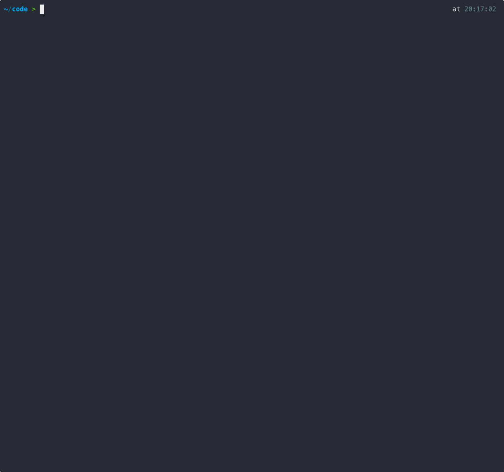

# llm-cli



A simple CLI wrapper for [Claude](https://github.com/anthropics/claude-cli) and [Gemini](https://github.com/google/generative-ai-cli) CLIs. Provides a unified interface to prompt different models without worrying about which underlying CLI to use.

## Features

- **Unified Interface** - Single CLI for both Claude and Gemini models
- **Model Aliases** - Easy-to-remember model names (haiku, opus, sonnet, gemini, flash)
- **Config Files** - Add custom models and change defaults via `~/.llm-cli/models.json` and `~/.llm-cli/options.json`
- **Streaming Output** - Real-time response streaming with progress indicator
- **Session Management** - Control where CLI sessions are stored (current dir or central location)
- **System Prompts** - Set context for your conversations

## Installation

### Homebrew (macOS/Linux)

```bash
brew tap fabriqaai/tap
brew install llm-cli
```

### From Source

```bash
go install github.com/fabriqaai/llm-cli@latest
```

Or build manually:

```bash
git clone https://github.com/fabriqaai/llm-cli.git
cd llm-cli
go build -o llm-cli .
mv llm-cli /usr/local/bin/
```

## First Run

**Suggested workflow:** Run llm-cli once to generate the default config files, then modify them to your needs.

```bash
# Run once to create default configs
llm-cli "hello"

# Now edit the generated config files
nano ~/.llm-cli/models.json
nano ~/.llm-cli/options.json
```

This creates two config files in `~/.llm-cli/`:
- **models.json** - Model aliases and mappings
- **options.json** - Session directory behavior

## Usage

```bash
# Simple prompt with default model (haiku)
llm-cli "what is the capital of france?"

# Use a specific model alias
llm-cli haiku "what is the capital of france?"
llm-cli opus "explain go interfaces"
llm-cli sonnet "write a python function"
llm-cli gemini "what is 2+2?"
llm-cli flash "translate hello to spanish"

# Using flags
llm-cli -m haiku "hello"
llm-cli -m opus -s "You are a Go expert" "how do I use interfaces?"
llm-cli -p "what is 2+2?"

# List all available models
llm-cli models

# Check version
llm-cli version

# Show help
llm-cli --help
```

## Commands

| Command | Description |
|---------|-------------|
| `[model] [prompt]` | Send a prompt to the LLM (root command) |
| `models` | List all available model aliases |
| `version` | Show version information |
| `--help` | Show help message |

## Flags

| Flag | Short | Description |
|------|-------|-------------|
| `--model` | `-m` | Model to use (e.g., haiku, opus, sonnet, gemini, flash) |
| `--prompt` | `-p` | Prompt text |
| `--system` | `-s` | System prompt for context |
| `--run-on-current-directory` | `-d` | Run CLI in current directory (overrides config) |

## Positional Arguments

```
llm-cli [model-alias] [prompt]
```

- **model-alias** (optional): Model alias like `haiku`, `opus`, `sonnet`, `gemini`, `flash`. If omitted, uses the default model (`haiku`).
- **prompt** (required): The prompt text to send to the LLM.

**Examples:**
```bash
# One arg = prompt, uses default model
llm-cli "hello world"

# Two args, first is a model alias
llm-cli opus "explain quantum computing"
```

## Configuration

### Models Config

The `~/.llm-cli/models.json` file contains all model aliases. After the first run, it will be populated with default models. You can:

**Add new models:**
```json
{
  "default_model": "haiku",
  "models": {
    "haiku": { "cli": "claude", "model_id": "claude-haiku-4-5-20251001" },
    "opus": { "cli": "claude", "model_id": "claude-opus-4-5-20251101" },

    "my-custom-model": {
      "cli": "claude",
      "model_id": "claude-3-5-sonnet-20241022"
    },
    "gpt4": {
      "cli": "llm",
      "model_id": "gpt-4"
    }
  }
}
```

**Change the default model:**
```json
{
  "default_model": "sonnet"
}
```

**Remove models you don't use:**
Simply delete the entries from the `models` object.

**Model config fields:**
| Field | Description |
|-------|-------------|
| `cli` | The CLI command to run (`claude`, `gemini`, or `llm`) |
| `model_id` | The model ID to pass to that CLI |

### Options Config

Edit `~/.llm-cli/options.json` to control session directory behavior:

```json
{
  "run_on_current_directory": true
}
```

- `true` (default) - CLI runs in current directory, sessions stored there
- `false` - CLI runs in `~/.llm-cli/sessions`, sessions stored centrally

You can override this with the `-d` flag:
```bash
llm-cli -d haiku "run in current directory"
```

## Sessions

When `run_on_current_directory` is true (default), the underlying CLI stores session history in the current directory. This allows you to:

1. Run llm-cli in a project directory
2. Have conversations specific to that project
3. Resume sessions later using the native CLI:
   ```bash
   claude --resume    # For Claude models
   gemini --resume    # For Gemini models
   ```

When `run_on_current_directory` is false, all sessions are stored in `~/.llm-cli/sessions/`.

## Available Models

Run `llm-cli models` to see all available models.

### Shortcuts

| Alias | Model |
|-------|-------|
| `haiku` | claude-haiku-4-5-20251001 |
| `opus` | claude-opus-4-5-20251101 |
| `sonnet` | claude-sonnet-4-5-20251001 |
| `claude` | claude-sonnet-4-5-20251001 |
| `gemini` | gemini-3-pro-preview |
| `flash` | gemini-3-flash-preview |

### Claude 4.5 Models

| Alias | Model |
|-------|-------|
| `haiku45` | claude-haiku-4-5-20251001 |
| `opus45` | claude-opus-4-5-20251101 |
| `sonnet45` | claude-sonnet-4-5-20251001 |

### Claude 3.5 / 3.7 Models

| Alias | Model |
|-------|-------|
| `haiku35` | claude-3-5-haiku-20241022 |
| `opus41` | claude-opus-4-20250101 |
| `sonnet35` | claude-3-5-sonnet-20241022 |
| `sonnet37` | claude-3-7-sonnet-20250219 |

### Gemini 3.0 Models

| Alias | Model |
|-------|-------|
| `gemini30` | gemini-3-pro-preview |
| `gemini30pro` | gemini-3-pro-preview |
| `gemini30flash` | gemini-3-flash-preview |
| `flash30` | gemini-3-flash-preview |

### Gemini 2.5 Models

| Alias | Model |
|-------|-------|
| `pro25` | gemini-2.5-pro-exp |
| `flash25` | gemini-2.5-flash |

## Requirements

- **Claude CLI** - Install via `npm install -g @anthropic-ai/claude-cli` (for Claude models)
- **Gemini CLI** - Install via `npm install -g @google/generative-ai-cli` (for Gemini models)

## License

MIT
